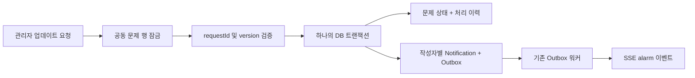

# 공동 문제(Incident) API — 1차 구현

2026-10-01. 원본 민원을 유지하면서 관리자가 같은 문제의 민원을 수동 연결하고, 처리 이력을 작성하면 연결된 작성자들에게 알리는 백엔드 MVP다.

## 범위와 결정

- 민원 하나의 현재 연결은 최대 하나다. 다른 문제로 옮기려면 먼저 해제한다. 공동 문제에는 여러 민원을 연결할 수 있다.
- 연결/해제로 원본 민원의 공개 여부, 제목, 본문, 상태는 바꾸지 않는다. 공동 문제 해결과 개별 주민의 민원 종결은 별개다.
- 신규 API는 매 요청마다 DB에서 활성 여부, 승인 상태, 현재 단지와 재거주 여부를 검증한다. JWT의 오래된 역할/단지 정보로 권한을 부여하지 않는다.
- 담당 ADMIN만 생성·연결·해제·업데이트할 수 있다. SUPER_ADMIN의 전 단지 운영 권한은 이번 API에 부여하지 않는다.
- 주민은 자신의 민원이 현재 연결된 문제만 조회한다. 다른 주민의 민원 ID·제목·본문·인원수는 응답하지 않는다. 관리자는 연결된 모든 민원 ID를 받는다.
- 제목·설명·진행 이력은 관련 주민에게 공개되는 내용이다. 원본 민원을 자동 복사하지 않는다. 관리자에게 공개용 내용임을 안내하는 UI가 필요하다.
- 생성은 최초 민원 1~100개를 받아 한 트랜잭션으로 연결한다. 연결 중 하나라도 다른 단지이거나 이미 다른 문제에 속하면 전부 롤백한다.
- AI 추천, 내부 메모, 별도 구독, 전체 공지 발행, 프런트 화면은 후속 단계다. 연결 변경 감사 이력도 후속 보완 항목이다.

## API

기존 accessToken 쿠키 또는 Bearer JWT를 사용한다. 아래 경로는 `/api/incidents` 기준이다.

| 메서드 | 경로 | 용도 |
| --- | --- | --- |
| POST | / | 공동 문제 생성 및 초기 민원 연결 |
| GET | /?page=1&limit=20 | 접근 가능한 문제 목록 |
| GET | /:incidentId | 공개 정보, 조회자에게 허용된 complaintIds, 최근 이력 20건 |
| POST | /:incidentId/complaints | 같은 단지 민원 추가 연결, 같은 연결 재요청은 성공 |
| DELETE | /:incidentId/complaints/:complaintId | 연결 해제, 반복 요청도 204 |
| POST | /:incidentId/updates | 처리 이력·상태·예정일 갱신 및 작성자별 알림 저장 |
| GET | /:incidentId/updates?page=1&limit=20 | 전체 이력 페이지 조회 |

목록/이력은 최신순, page 1~100000, limit 1~100. 목록 응답은 `{ incidents, totalCount }`, 이력 응답은 `{ updates, totalCount }`다.

생성 예시:

```json
{
  "title": "101동 1호기 운행 장애",
  "description": "점검 업체에 접수한 공동 시설 장애입니다.",
  "complaintIds": ["민원-ID-1", "민원-ID-2"]
}
```

생성 응답: 201, `{ id, title, description, status, expectedResolutionAt, version, createdAt, updatedAt }`. 최초 status=PENDING, version=0.
추가 연결 요청은 `{ "complaintIds": ["민원-ID-3"] }`이다.

처리 업데이트 예시:

```json
{
  "requestId": "9fb09473-33d5-49ac-8234-fa58bf825802",
  "expectedVersion": 0,
  "content": "업체 방문을 예약했습니다. 10월 3일 오후 1시 점검 예정입니다.",
  "status": "IN_PROGRESS",
  "expectedResolutionAt": "2026-10-03T13:00:00+09:00"
}
```

응답은 200, `{ "updateId": "생성된-이력-ID", "version": 1 }`이다.

- UI는 제출할 때 requestId(UUID 권장)를 한 번 만들고 네트워크 오류 재시도에는 같은 ID와 같은 본문을 유지한다. 매 재시도마다 새 ID를 만들면 안 된다.
- expectedVersion은 마지막으로 조회한 공동 문제 version. 다른 관리 작업이 먼저 반영됐으면 409를 반환하므로 최신 내용을 조회해 다시 판단한다.
- 동일 requestId/본문 재전송은 원래 updateId/version을 반환한다. 이력·알림을 재생성하지 않는다. 같은 ID에 다른 본문을 보내면 409.
- expectedResolutionAt은 필수다. `null`은 예정일 없음/제거, 시간대가 있는 ISO 문자열은 설정이다.
- 상태 전이: PENDING→IN_PROGRESS→RESOLVED, RESOLVED→IN_PROGRESS 재개 허용. 같은 상태에서 설명·예정일만 업데이트할 수도 있다. 각 업데이트에는 설명이 필수다.
- 입력 형식 오류 400, 미인증 401, 역할/승인/거주 부적합 403, 없는 자원·다른 단지·연결 없는 주민 조회 404, 연결/버전/재요청 충돌 409.

## 저장·전송 구조



민원 연결은 대상 공동 문제 행과 정렬된 민원 행을 잠근다. Complaint ID 기본 키로 같은 민원의 다중 연결도 차단한다. 업데이트와 연결 변경은 공동 문제 행 잠금을 공유하므로 업데이트 수신 대상을 결정하는 도중 동일 문제의 연결이 바뀌지 않는다.

수신자는 연결된 민원의 작성자 중 현재 해당 단지에 거주하는 승인·활성 USER다. 사용자 테이블에서 조회하므로 같은 사람이 여러 민원을 작성해도 한 번만 선택된다. 별도 구독 테이블 없이 연결 관계를 현재 수신 대상의 기준으로 삼는다.

키는 `INCIDENT_UPDATED:{incidentId}:{updateId}`이며 기존 `(userId, dedupeKey)` DB 유니크 제약과 결합한다. 새 처리 이력은 새 이벤트이므로 재개·재완료 때 필요한 새 알림이 억제되지 않는다.

새 API는 Redis에 즉시 발송하지 않는다. 업무 변경, 이력, Notification, Outbox를 함께 커밋하고 기존 60초 주기의 Outbox 워커가 처리한다. 알림함의 DB 조회 경로로도 미확인 알림을 읽을 수 있다. 실패가 나면 모두 롤백된다.

이 보장은 **업데이트별 사용자 알림 레코드 중복 방지**다. 네트워크 전송 자체가 딱 한 번이라는 보장은 아니다. 전송 후 워커가 종료되면 재전송될 수 있으므로 프런트는 notificationId로 중복 표시를 제거해야 한다. 기존 워커는 실패 재시도 횟수가 제한되어 있어 최종 실패 관제/재처리는 별도 보완이 필요하다.

알림 DTO에는 기존 필드에 `sourceType`과 `sourceId`를 추가했다. `INCIDENT_UPDATED` 알림은 `sourceType=INCIDENT`, `sourceId=공동 문제 ID`로 상세 API를 조회하면 된다. 프런트의 알림 클릭 이동과 화면은 아직 구현하지 않았다. 알림 문구에는 공개 이력 본문을 넣지 않아, 나중에 연결 해제되더라도 과거 알림에서 내용이 새어나가지 않는다.

## 검증과 실행

잠금 파일의 누락된 선택 의존성을 보완했다. `npm ci` → `npx prisma generate` → 테스트 전용 DB에 `npx prisma migrate deploy` → `npm test -- --runTestsByPath tests/incident.test.ts` 순서로 실행한다. DATABASE_URL은 반드시 테스트 DB로 설정한다.

새 테스트는 UUID로 생성한 자체 fixture만 정리한다. 원자성 검증은 해당 테스트 Incident ID에 한정된 Outbox CHECK 제약을 임시 추가해 저장 실패를 유발하고 finally에서 제거한다. 실제 데이터가 있는 DB에서 실행하지 않는다.

19개 통합 테스트: 비인증·역할 위조, 단지 격리, 승인 취소·퇴거, 비공개 민원 보호, 원본 보존, 일괄 작업 롤백, 연결 충돌·반복 해제, 입력 검증, 동일 업데이트 동시 10회, 버전 충돌 동시 10회, 재개·재완료 알림, 연결 해제 후 알림 제외, Outbox 실패 원자성.

2026-10-01 임시 PostgreSQL 18.4에서 기존 24개 및 신규 1개 마이그레이션 적용과 위 통합 테스트를 검증했다. 저장소 CI의 PostgreSQL 16 실행 결과는 별도 확인이 필요하다. 실제 브라우저 SSE 수신과 Redis 장애 복구를 이 통합 테스트가 검증하는 것은 아니다.
